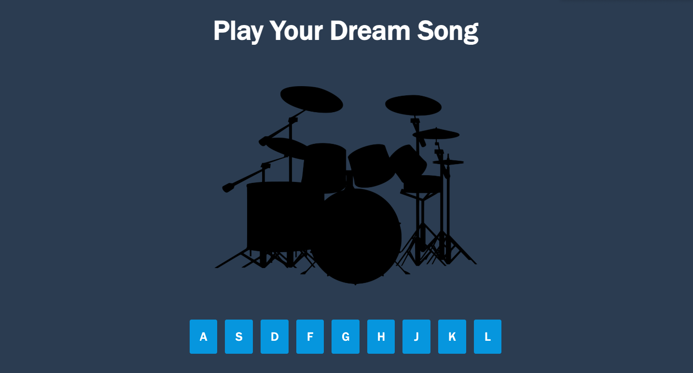

# Javascript Drum Kit

## 📖 Proje Açıklaması

Klavye tuşlarına veya ekrandaki butonlara basarak farklı davul sesleri çalabileceğiniz etkileşimli bir JavaScript uygulaması.  
Aktif tuş için "pulse", diğer tuşlar için hafif "wiggle" animasyonları içerir.

---

## 🛠️ Teknolojiler

- HTML5  
- CSS3 (Animasyonlar dahil)  
- JavaScript (DOM, Event Listener, Audio API)  

---

## 💻 Kurulum ve Kullanım

Projeyi bilgisayarınızda çalıştırmak için:

1. Bu repoyu klonlayın:
   ```bash
   git clone https://github.com/devburcu/Javascript-Drum-Kit.git

2. Proje klasörüne gidin:
    ```bash
    cd proje-adi

3. index.html dosyasını bir web tarayıcısında açın.

4. Klavyeden A, S, D, F, G, H, J, K, L tuşlarına basarak veya butonlara tıklayarak davul seslerini çalabilirsiniz.

## 🚀 Canlı Demo

Projeyi canlı olarak görmek için [buraya tıklayın](#)

## 📸 Ekran Görüntüsü



## ✨ Özellikler

- Buton ve klavye ile ses çalma

- Aktif tuş için büyüyüp renk değiştiren animasyon

- Diğer tuşlarda kısa titreşim efekti

- Responsive, görsel olarak çekici tasarım